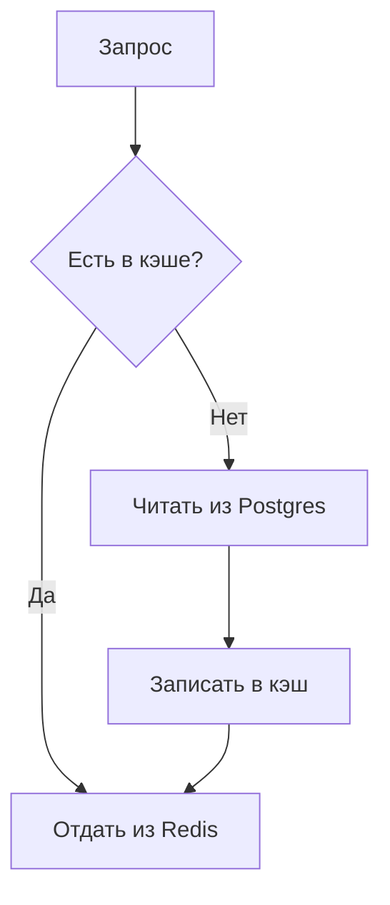

# Obsidian Showcase

Один файл, весь спектр форматирования, который умеет ядро Obsidian без единого
плагина. Не шаблон для копирования целиком — см. `style.md`: реальный доклад
использует одну десятую этого. Это справочник «как это вообще выглядит»,
открой в Obsidian и смотри рендер живьём.

## 1. Properties (frontmatter)

Показаны в блоке выше: text (`title`), type-enum (`type`, `status`), date
(`date`), number (`rating`), checkbox (`completed`), date+time (`due`),
list (`tags`, `related`), links-as-list (`related` содержит `[[wikilinks]]`),
`aliases`, `cssclasses`. Полный разбор типов — `properties.md`.

## 2. Заголовки

Один `#` H1 на файл (см. выше), дальше `##`/`###` по needed. Пробел после
`#` всегда.

## 3. Внутренние ссылки (wikilinks)

- Обычная: [[orders]]
- С display text: [[orders|сервис заказов]]
- На заголовок: [[orders#Run]]
- На блок: см. блок-пример ниже, ссылка вида `[[Note#^block-id]]`
- На заголовок в этом же файле: [[#7. Диаграмма (Mermaid)]]

Внешняя ссылка — обычный markdown, никогда не wikilink: [Obsidian Help](https://help.obsidian.md).

### Block ID

Этот абзац можно линковать напрямую, не весь файл и не весь раздел. ^showcase-block

Для списков и цитат ID ставится отдельной строкой после блока:

> Цитата, которую тоже можно линковать напрямую.

^showcase-quote

## 4. Embeds

`![[Note]]` эмбедит целиком, `![[Note#Heading]]` — только секцию,
`![[image.png|300]]` — картинку шириной 300px. Полный разбор — `embeds.md`.
Пример (без реального файла, чисто синтаксис):

```markdown
![[orders#Run]]
![[architecture-diagram.png|600]]
![[runbook-orders-failover.pdf#page=2]]
```

Поиск-эмбед (не Dataview, нативный core):

````markdown
```query
tag:#adr status:accepted
```
````

## 5. Callouts — все 13 типов

> [!note]
> Базовый note — общая заметка на полях.

> [!abstract] TL;DR
> Краткая выжимка длинного отчёта наверху (alias: `summary`, `tldr`).

> [!info]
> Контекст, который нужен читателю перед тем, как читать дальше.

> [!todo]
> Открытый пункт действия внутри отчёта.

> [!tip] Не самая очевидная штука
> Операционный совет — хорошо заходит в runbook (alias: `hint`, `important`).

> [!success] Готово
> Подтверждённый результат, закрытый пункт (alias: `check`, `done`).

> [!question] Открытый вопрос
> ADR ещё не решил этот момент (alias: `help`, `faq`).

> [!warning] Прочитай перед тем как делать X
> Риск или компромисс (alias: `caution`, `attention`).

> [!failure] Альтернатива отклонена
> Что не сработало, почему проиграло (alias: `fail`, `missing`).

> [!danger] Необратимое действие
> Предупреждение уровня runbook, шаг нельзя откатить (alias: `error`).

> [!bug]
> Известный дефект, стоит пометить прямо в тексте.

> [!example]
> Конкретный пример payload/before-after.

> [!quote] Кто-то сказал
> Атрибутированная цитата, не общая заметка (alias: `cite`).

### Foldable

> [!faq]- Свёрнут по умолчанию
> Скрыто, пока читатель не развернёт — для деталей, которые не нужны сразу.

> [!faq]+ Развёрнут по умолчанию
> Видно сразу, но можно свернуть.

### Nested

> [!question] Внешний
> > [!note] Вложенный
> > Один уровень читается нормально, два — уже повод переходить на заголовки.

## 6. Tags

Инлайновый тег в тексте: #follow-up рядом с предложением, которому он нужен.
Вложенный: #project/konseputo-suite. То же самое можно (и обычно нужно для
основной классификации) держать в properties — `tags:` наверху файла.

## 7. Диаграмма (Mermaid)



Рендерится нативно, без плагина. Когда это реально оправдано, а когда три
предложения быстрее — `style.md`.

## 8. Highlight

Обычный текст, ==а вот это выделено фоном== — Obsidian-специфичный синтаксис,
не стандартный markdown. Используй на одном-двух словах, не на абзаце.

## 9. Comments

Видимый текст %%а это скрыто в reading view%% — продолжение видимого текста.

%%
Целый блок, скрытый при чтении. Для заметок себе-редактору, не для секретов.
%%

## 10. Math (LaTeX)

Инлайн: $e^{i\pi} + 1 = 0$.

Блок:

$$
\frac{a}{b} = c
$$

## 11. Footnotes

Утверждение, для которого нужна сноска, не ломающая абзац[^1].

Инлайн-сноска прямо тут.^[Не требует отдельного определения ниже.]

[^1]: Вот содержимое сноски — источник, оговорка, версия.

## 12. GFM — таблицы, чеклисты, зачёркивание

| Колонка | Значение |
|---|---|
| Работает из коробки | Да |
| Нужен плагин | Нет |

- [x] Пункт сделан
- [ ] Пункт открыт
  - [ ] Подпункт

~~Зачёркнутый текст~~ — GFM, не Obsidian-специфика.

## Что сюда специально не попало

Dataview-блоки (` ```dataview `), Templater-синтаксис (`<% %>`) — не core,
этот скилл их не производит (`SKILL.md`, «Zero plugin dependency»). Bases
(`.base` файлы) — core-фича, но не строится спекулятивно; см. `SKILL.md`'s
Bases-заметку и `embeds.md`'s "Embed Bases".
