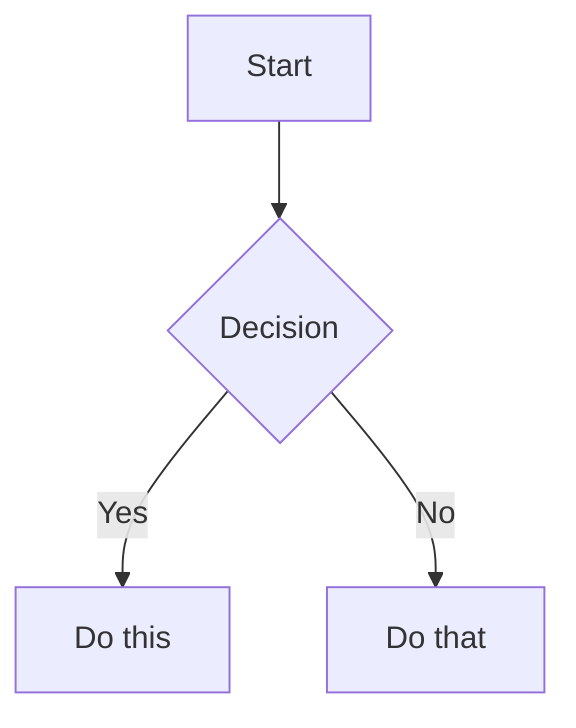

# Core syntax — wikilinks, tags, comments, highlight, math, Mermaid, footnotes

Obsidian extends CommonMark + GFM (tables, task lists, strikethrough,
autolinked URLs — assume these as known). This file covers the
Obsidian-specific extensions not already broken out into
`callouts.md`/`embeds.md`/`properties.md`.

## Internal links (wikilinks)

```markdown
[[Note Name]]                          Link to note
[[Note Name|Display Text]]             Custom display text
[[Note Name#Heading]]                  Link to heading
[[Note Name#^block-id]]                Link to block
[[#Heading in same note]]              Same-note heading link
```

Use `[[wikilinks]]` for anything inside the vault — Obsidian tracks renames
automatically, backlinks and the graph view depend on it. Use
`[text](url)` for external URLs only. Never wikilink a URL; never
markdown-link a note that lives in the same vault.

### Block IDs

Append `^block-id` to link to a specific paragraph, not just a note or heading:

```markdown
This paragraph can be linked to directly. ^my-block-id
```

For lists and quotes, the block ID goes on its own line after the block:

```markdown
> A quote worth linking to directly.

^quote-id
```

Reference it from elsewhere: `[[Note Name#^quote-id]]`.

## Tags

```markdown
#tag                    Inline tag
#nested/tag             Nested tag, hierarchy via /
```

Allowed characters: letters (any language), numbers (not as the first
character), underscores, hyphens, forward slashes. Same tag can live inline
in prose or in the `tags:` frontmatter property — frontmatter is preferred
for a note's primary classification, inline `#tag` for a marker embedded in
running text (e.g. `#follow-up` next to the sentence that needs one).

## Comments

```markdown
This is visible %%but this is hidden%% text.

%%
This entire block is hidden in reading view.
%%
```

Visible in edit mode, hidden in reading view and when published. Use for
editor-only notes to future editors (yourself included) — never for secrets,
it's not encryption, just a rendering toggle.

## Highlight

```markdown
==Highlighted text==
```

Obsidian-only, not standard Markdown — renders with a background color.
Sparingly: a paragraph that's all `==highlighted==` highlights nothing. One
or two words per note, on the thing that actually needs to jump out.

## Math (LaTeX / MathJax)

```markdown
Inline: $e^{i\pi} + 1 = 0$

Block:
$$
\frac{a}{b} = c
$$
```

Standard LaTeX math commands render via MathJax. Only pull this in for
actual math — don't reach for `$O(n \log n)$` notation as decoration in a
doc that's not otherwise technical.

## Diagrams (Mermaid)

````markdown

````

Renders natively, zero plugin. To link a Mermaid node to an actual vault
note, add `class NodeName internal-link;`. See `style.md` for when a diagram
earns its lines versus when three sentences of prose says the same thing
faster.

## Footnotes

```markdown
Text with a footnote[^1].

[^1]: Footnote content.

Inline footnote.^[This is inline, no separate definition needed.]
```

Use for an aside that's true and worth keeping but would break the
paragraph's flow if inlined — a caveat, a source, a version note. Not a
dumping ground for things that should just be cut.

## Headings

One `#` H1 per note, matching the note's title/filename — or skip the H1
entirely and let the filename serve as the title (Obsidian shows the
filename as the note's heading in most views either way). Always a space
after `#`.

A `title:` property alongside an H1 is fine and expected for the doc-types
in `doc-types.md` — there the `title:` property is doing real work (it
feeds Bases table/card views and drives `[[wikilink]]`/alias resolution),
while the H1 carries readability in reading view. What to avoid is a
`title:` property that only duplicates the filename and feeds nothing —
that's metadata for its own sake. If the property is queried by a Base or
aliased, keep it; if it's inert, drop it and let the filename/H1 stand.

## What NOT to reach for

No Dataview query blocks (` ```dataview `), no Templater syntax
(`<% %>`), no plugin-specific embeds beyond what's core (Bases files are
core, community-plugin embeds are not). If a generated doc needs a
community plugin to render correctly, it's not portable — don't produce it.
